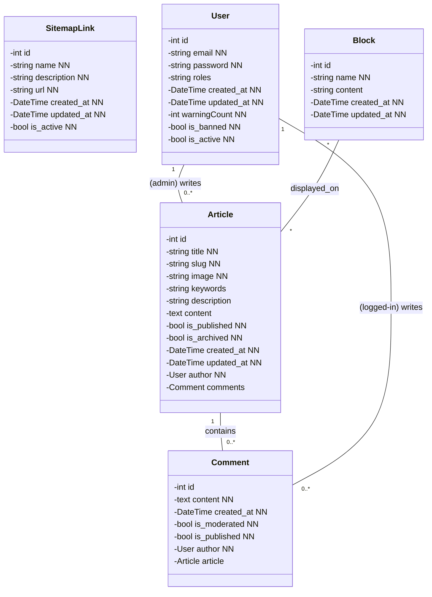
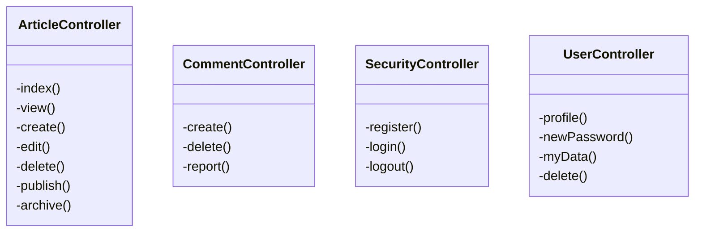
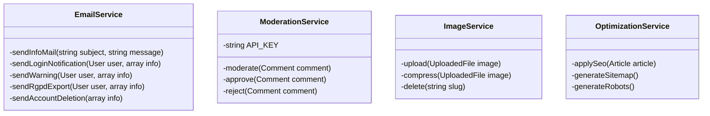
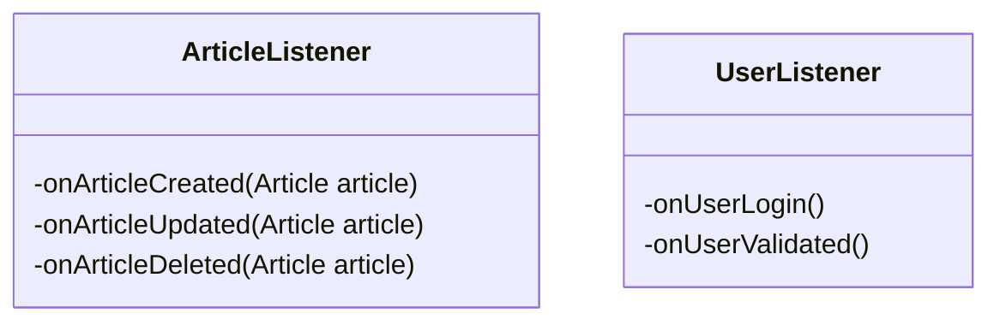
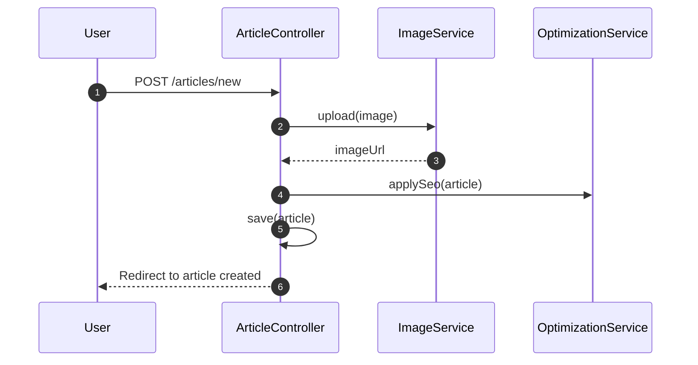
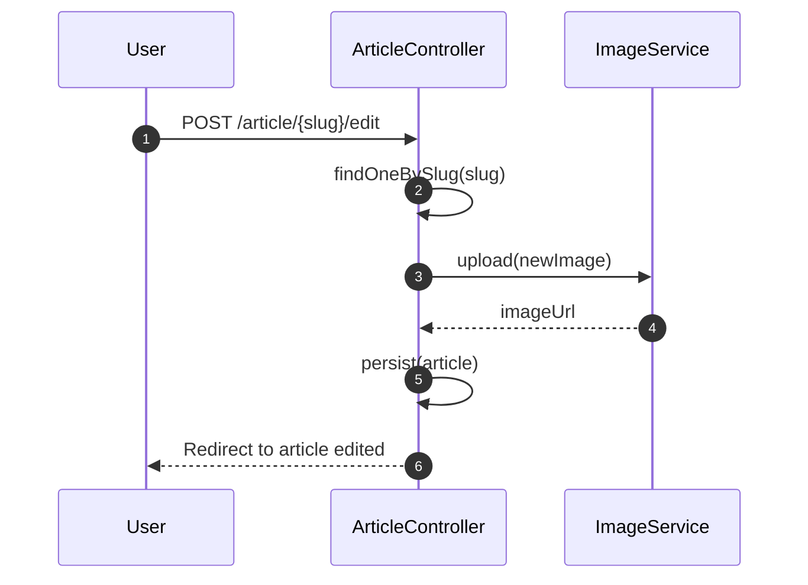
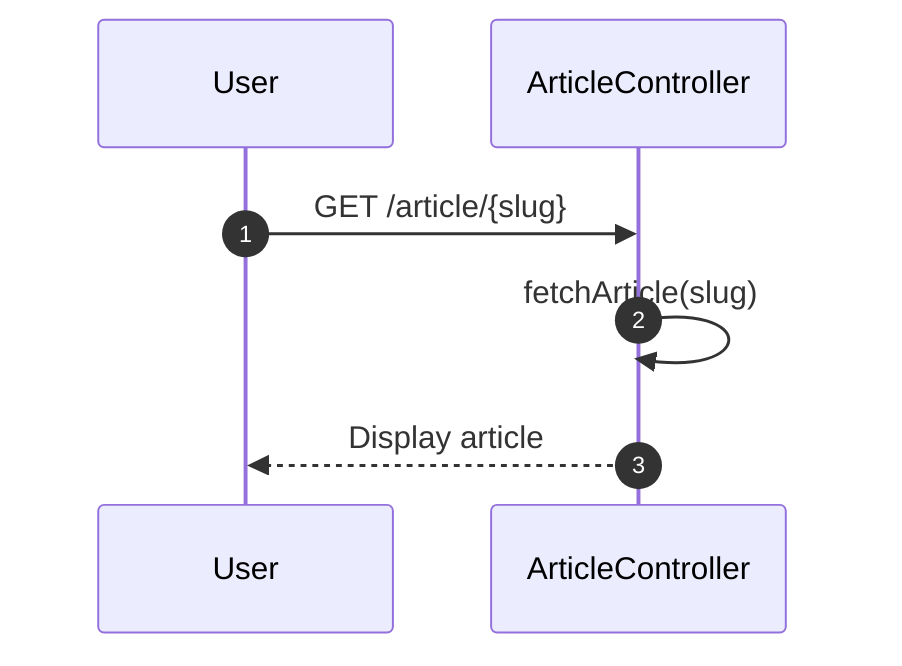
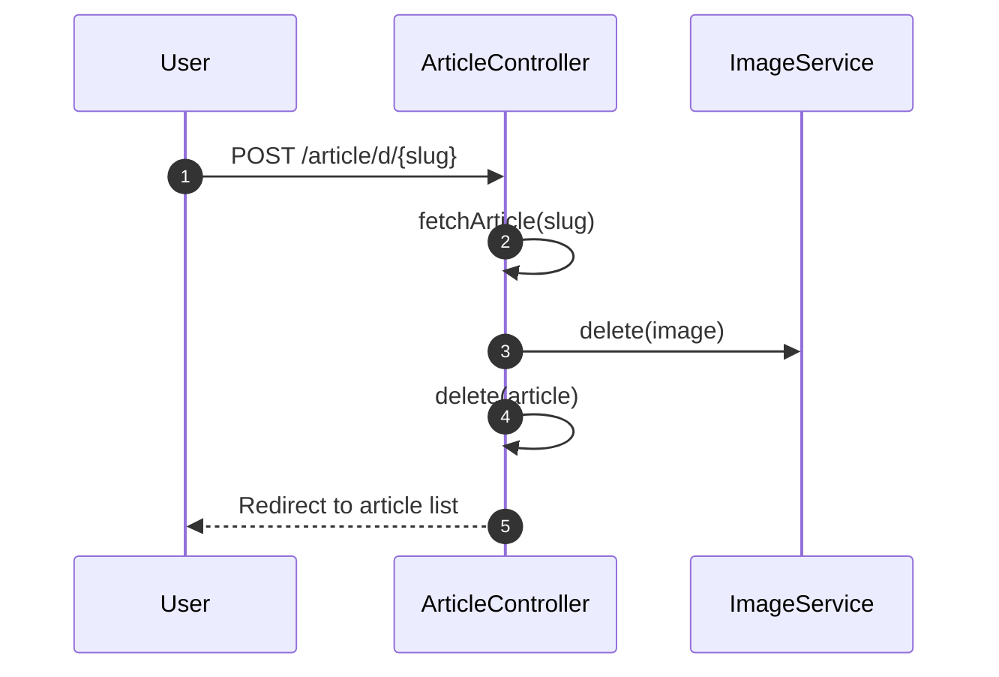
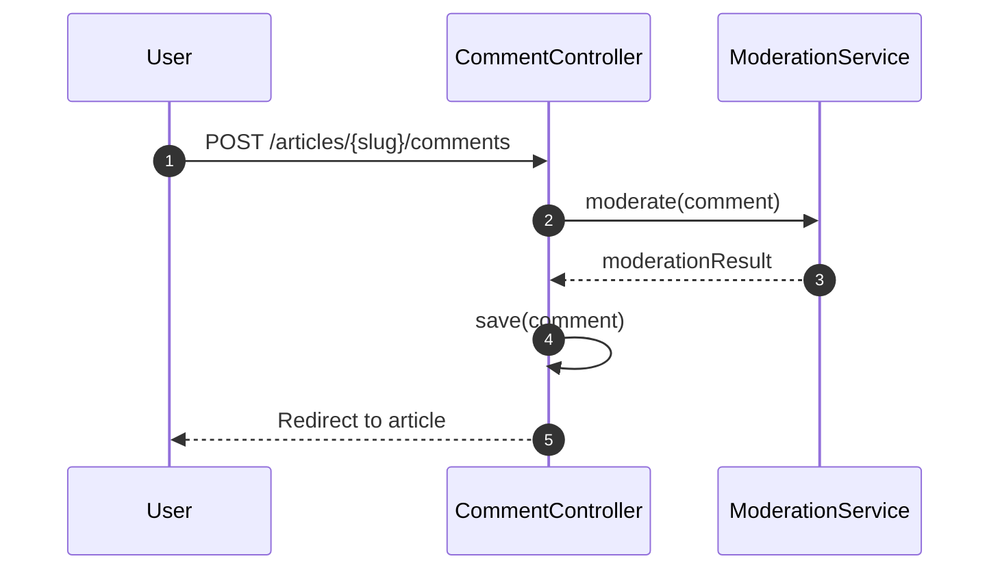
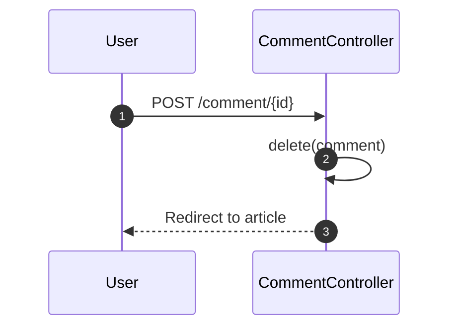

# Premier pas avec Symfony

## Présentation

Créons un blog pour apprendre à utiliser Symfony 7.

## Liste priorisée de user stories

| Priorité | Rôle                 | Action                                                                 | Bénéfice                                                             |
| :-------: | --------------------- | ---------------------------------------------------------------------- | ---------------------------------------------------------------------- |
|     1     | Visiteur              | Consulter la liste des articles                                        | Découvrir rapidement le contenu disponible                            |
|     2     | Visiteur              | Lire un article détaillé                                             | Approfondir un sujet d’intérêt                                      |
|     3     | Utilisateur           | S’inscrire / se connecter                                             | Participer (commentaires) et accéder aux fonctionnalités protégées |
|     4     | Utilisateur connecté | Poster un commentaire                                                  | Partager son avis et échanger                                         |
|     5     | Utilisateur connecté | Éditer ou supprimer son propre commentaire                            | Gérer et corriger son contenu                                         |
|     6     | Administrateur        | Créer / supprimer un article via EasyAdmin                            | Gérer le contenu du blog de manière structurée                      |
|     7     | Administrateur        | Gérer (activer/désactiver) et modérer les commentaires              | Maintenir un espace de discussion respectueux des CGU                  |
|     8     | Administrateur        | Gérer les utilisateurs (rôles, blocage)                              | Contrôler l’accès et la sécurité du site                          |
|     9     | Administrateur        | Configurer les blocs dynamiques du front (header, footer, sidebar)     | Personnaliser la mise en page sans recoder                             |
|    10    | Administrateur        | Consulter des statistiques basiques (nombre d’articles, commentaires) | Suivre l’activité du site                                            |

## 📘 Models (Database/Class Diagram)

## 🧭 Controllers

## 🔧 Services

## 🎧 Event Listeners

## 📑 Sequence Diagrams

### Create an article

### Edit an article

### View an article

### Delete an article

### Post a comment

### Delete a comment

### Routes

| Route         | Accès                 | Fonctionnalités principales                                                                                 |
| ------------- | ---------------------- | ------------------------------------------------------------------------------------------------------------ |
| /articles     | Tout le monde          | Voir tous les articles (pagination, filtrage, cliquables)                                                    |
| /article/slug | Tout le monde          | Lire l'article, lire/écrire des commentaires, fiche auteur, liker, favoris, partager, signaler l'article    |
| /authors      | Tout le monde          | Liste des auteurs avec informations                                                                          |
| /author/name  | Tout le monde          | Voir tous ses articles, follow l'auteur, voir ses infos                                                      |
| /search       | Tout le monde          | Rechercher et consulter les résultats                                                                       |
| /dashboard    | Admin                  | Toutes les fonctionnalités d'administration                                                                 |
| /inscription  | Tout le monde          | S'inscrire                                                                                                   |
| /connexion    | Tout le monde          | Se connecter                                                                                                 |
| /             | Tout le monde          | Derniers articles, articles les plus likés, incitation à l'inscription, navigation, catégories d'articles |
| /profil/name  | Tout le monde (public) | Voir l'activité sur l'app                                                                                   |
| /settings     | Connecté              | Gérer ses paramètres et informations personnelles                                                          |
| /support      | Connecté              | Ouvrir des tickets de support                                                                                |
| /notification | Connecté              | Voir notifications : likes, auteurs suivis, mentions, suivi de ses articles, follow si auteur                |
